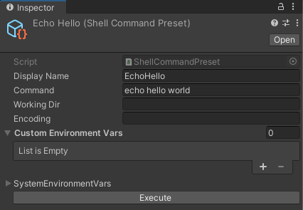
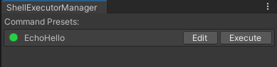

# UnityShell

Execute awaitable shell commands in Unity Editor, and create Shell Command Preset assets for ease of use by non-programmers. Supports OSX & Windows.

# Install

## Git Dependency

You can add the package to your project as a [git upm dependency](https://docs.unity3d.com/Manual/upm-git.html).

Either add the following line to your project's `Packages/manifest.json` file's dependencies:

    "com.mezookan.shell":"https://github.com/abbabon/UnityShell.git",

or via the `Windows/PackageManager` menu, by adding the following git repo: https://github.com/abbabon/UnityShell.git

# Running commands from code

For example, this is how to execute the command `ls` and print the results into the Unity console:

``` csharp

var shellCommandToken = UnityEditorShell.Execute("ls");
shellCommandToken.OnExit += (exitCode) => 
{
    // Do Nothing!
};
shellCommandToken.OnLog += (logType, log) =>
{
    Debug.Log(log);
};

int exitCode = await shellCommandToken;
```

This is how to run the same command with different [Options](#options)

* use `Options` to 

``` csharp

var options = new UnityEditorShell.Options(){
    WorkDirectory = "/Users/Mezookan/",
    Encoding = System.Text.Encoding.GetEncoding("GBK"), 
    EnvironmentVariables = new Dictionary<string, string>(){
        {"PATH","usr/bin"},
        {"SHELL","/bin/zsh"},
    }
};

var shellCommandToken = UnityEditorShell.Execute("ls", options);

....

```

The Shell Command Tokens, which is the way to interact with a queued command, are awaitable (check out `ShellCommandAwaiter` for the implementation); either as a task as used in the Tests suite, or as [UniTasks](https://github.com/Cysharp/UniTask), which I strongly recommend you use in your project.

# Running commands from a preset

You may create a Scriptable Object with 'presets' of commands you can configure, and use them as a tool for you and your colleagues.

Create an asset either via right-clicking on the Project view or through the `Assets/Create` dropdown menu, and choosing `UnityShell/ShellCommandPreset`.



To manage the entire project's library of ShellCommandPresets, you may use an Editor Window, you can open via the menu `Tools/ShellCommandPresetsManager`. 



# Options

The options for the command may be configured either from code (as in the examples above) or via the Shell Command Presets scriptable objects.

## Working Directory

By default, the working directory for each shell is `./`. You may override it instead of using the `cd` command to navigate around.


## Encoding

By default, EditorShell uses `UTF8` for encoding. If you receive unrecognizable characters as an output and need to process more complex Encodings, please check your shell app's (`bash` in osx and `cmd.exe` in windows) encoding, and config options.encoding same as that.

## Environment Variables

By default, the environment variables are empty. No default `.profile` or similar files are sourced by default when executing a command. 

This is your way to configure environment variables manually. 
